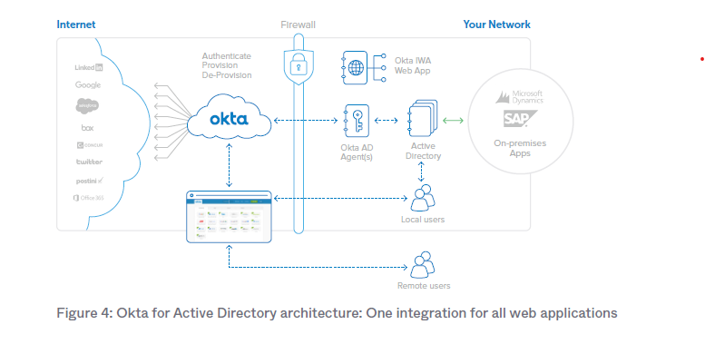

# OKTA Integration with Azure AD and Office 365

This repository documents the process of integrating OKTA with Azure Active Directory(Entra ID) (Azure AD), Active Directory, using Azure AD as the Identity and Access Management (IAM) solution. Additionally, it includes steps to deploy Single Sign-On (SSO) applications on the OKTA dashboard.

## Overview

This project integrates OKTA, Azure AD, and Office 365 to establish a robust IAM and SSO framework. The integration enables seamless authentication, improved security, and automated license provisioning across applications and services.

### Key Components:
- **OKTA**: Used as the SSO platform for cloud application access.
- **Azure AD**: Serves as the primary IAM system.
- **Office 365**: Provides user productivity tools and will be integrated into OKTA for SSO.
- **Hybrid Cloud Identity**: Local AD synced to Azure AD via Entra ID Connect, enabling hybrid identity management.

---

## Project Prerequisites

### Tools and Software
- Azure AD (Microsoft Entra ID)
- OKTA Developer Account
- Office 365 subscription
- VMware Workstation (optional for lab setup)
- pfSense for network management (if applicable to your environment)

### Environment Setup
1. **Local AD Configuration**
   - Deploy Windows Server 2019 as a Domain Controller.
   - Create and configure a domain (e.g., `vegas-IT.local`).
   - Add users and groups.

2. **Azure AD Integration**
   - Sync local AD with Azure AD using Azure AD Connect.
   - Verify synchronization of users and groups.

3. **Office 365 Setup**
   - Use a custom domain (e.g., `vegas-it.com`) registered on AWS Route 53.
   - Integrate the custom domain with Office 365.

---

# Provision users into Microsoft Azure Active Directory

# User Directories and the Cloud:

Microsoft Active Directory (AD) plays a central role in coordinating identity and access management policies. AD typically serves as the "source of truth" for user identities and provides access control to on-premises resources such as networks, file servers, and web applications. When on-premises applications are integrated with Active Directory, users benefit from a seamless experience: they log in to their domain once and gain access to the appropriate resources. Administrators also maintain clear control over access permissions. This model has been widely adopted because it works effectively within LAN-based architectures, where applications are hosted on hardware inside the firewall. However, as enterprises increasingly shift to cloud-based applications, this approach faces limitations, necessitating a new solution.

The shift to cloud applications has led to the proliferation of separate user stores, with each application maintaining its own user credentials. While manageable with one or two applications, this becomes unmanageable as more are adopted, leading to password sprawl and loss of administrative control. Deactivating accounts for departing employees becomes complex, with limited auditing or timely deprovisioning, further compounding the challenge.

Okta’s cloud-based identity and access management service solves these problems with a single integration point that provides a highly available solution for all cloud
and web-based application AD and LDAP integrations.

Okta provides a simple directory integration solution for both cloud and on-premises web applications. Its Identity and Access Management service offers user authentication, provisioning, de-provisioning, and analytics. Okta’s directory integration is easy to set up, highly available, and supports thousands of applications through the Okta Application Network (OAN). Key components for AD integration include:

• Okta Active Directory Agent: A lightweight agent that can be installed on anyWindows Server and is used to connect to on-premises Active Directory for user provisioning, deprovisioning, and authentication requests.
• Okta Integrated Windows Authentication (IWA) Web Application: A lightweight web application that is installed on an Internet Information Services (IIS) and is used to authenticate domain users via Integrated Windows Authentication.
• Okta Active Directory Password Sync Agent: A lightweight agent installed on your domain controllers that will automatically synchronize AD password changes, send to Okta, and keep your user’s AD passwords in sync with the apps they use.

1. Simple and Secure Setup and Configuration  
2. Real-time Provisioning  
3. Intelligent User Synchronization  
4. Just-in-time User Provisioning  
5. Robust Delegated Authentication  
6. Integrated Desktop Single Sign-On (SSO) (AD Only)  
7. Self-Service Password Reset Support (AD Only)  
8. Security Group-Driven Provisioning  
9. Automated One-Click Deprovisioning  
10. Single Sign-On for Directory Authenticated Apps  

## Integration Steps

You can create a developer account using a company email. I purchased a domain and hosted it on NameSilo, which offers email domain services for just $3. I used one of these email addresses to start a trial account. Note that it’s unlikely you’ll be able to complete this process using a personal email, such as Gmail.

### 1. Configure OKTA
1. Log in to your OKTA Admin Console.
2. Navigate to **Applications** > **Applications**.
3. Click **Create App Integration** and select **SAML 2.0**.
4. Configure the following:
   - **App Name**: Provide a name for the app (e.g., Office 365 SSO).
   - **Single Sign-On URL**: Use the SAML endpoint from Azure AD.
   - **Audience URI (SP Entity ID)**: Provide your Azure AD's Identifier.

### 2. Set Up Azure AD as an Identity Provider
1. Log in to Azure Portal.
2. Navigate to **Azure Active Directory** > **Enterprise Applications** > **+ New Application**.
3. Search for **OKTA** or choose **Non-Gallery Application**.
4. Configure the following:
   - Upload the OKTA SAML metadata file.
   - Set up attribute mappings for user provisioning.

### 3. Enable User Provisioning
1. **Create Security Groups in On-Premises AD**:
   - Add a security group in your local Active Directory (e.g., `XYZ_App_License_Group`).
   - Add users who need access to the specific application (e.g., Office 365) to this group.
2. **Sync Groups to Azure AD**:
   - Use Entra ID Connect to sync the created security group to Azure AD.
   - Confirm the group appears in Azure AD under **Groups**.
3. **Assign Licenses to Azure AD Group**:
   - In the Azure Portal, go to **Azure Active Directory** > **Licenses** > **All Products**.
   - Select the license you want to assign (e.g., Office 365 E3).
   - Click **Assign** and choose the synced security group (e.g., `XYZ_App_License_Group`).
   - Save and confirm that the license is applied to all users in the group.
4. **Provision Application in OKTA**:
   - Configure the application (e.g., Office 365) in OKTA to recognize the Azure AD group for provisioning.
   - Test the configuration by ensuring users in the group gain appropriate access.

### 4. Deploy Office 365 on OKTA Dashboard
1. In OKTA Admin Console:
   - Navigate to **Applications** > **Applications**.
   - Search for **Office 365** and add it as an application.
   - Configure SSO settings using the Azure AD SAML details.
2. Test the integration by logging in to OKTA and accessing Office 365.

---

## Testing and Validation
- **User Authentication**: Ensure users can log in to OKTA using Azure AD credentials.
- **SSO Access**: Verify seamless access to Office 365 and other configured applications.
- **Group Policies**: Confirm role-based access is working as intended.
- **License Provisioning**: Validate that group memberships in on-premises AD trigger license provisioning via Azure AD and OKTA.

---

## Troubleshooting
- **Provisioning Errors**: Check SCIM configurations in both OKTA and Azure AD.
- **SAML Errors**: Validate endpoint URLs and certificate mappings.
- **Sync Issues**: Ensure Azure AD Connect is configured correctly.
- **License Provisioning Issues**: Confirm group memberships in on-premises AD and verify synchronization with Azure AD.

---

## Future Enhancements
- Add Multi-Factor Authentication (MFA) policies in OKTA for enhanced security.
- Integrate additional cloud applications into OKTA.
- Explore Conditional Access policies in Azure AD.

---

## References
- [OKTA Developer Documentation](https://developer.okta.com/)
- [Azure AD Documentation](https://learn.microsoft.com/en-us/azure/active-directory/)
- [Office 365 Integration Guide](https://learn.microsoft.com/en-us/microsoft-365/enterprise/)

