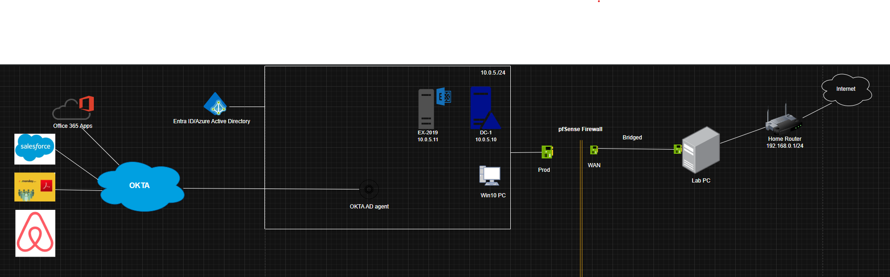
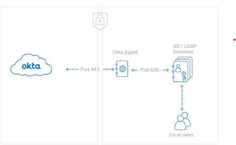
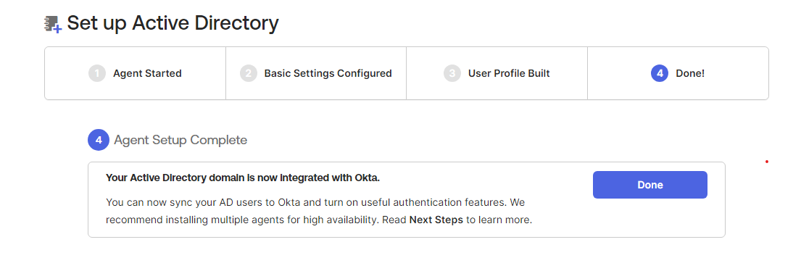
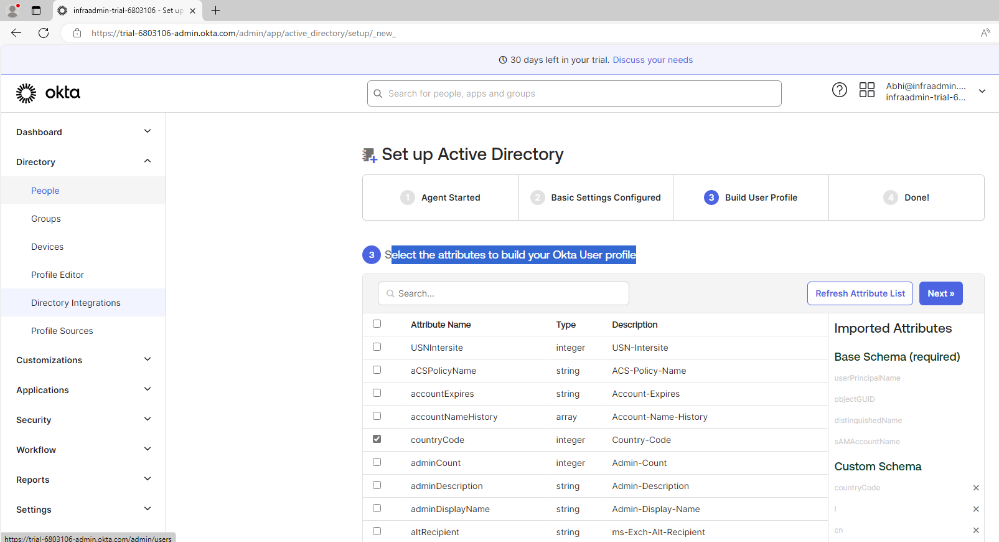

# Active Directory (On-Premises) Integration with Okta

This document outlines the process of integrating **on-premises Active Directory (AD)** with **Okta** to enable seamless **Identity and Access Management (IAM)** across hybrid environments. This integration allows for secure access to cloud applications while leveraging existing on-prem AD user credentials.

## Overview

The integration enables the synchronization of users, groups, and attributes from on-premises Active Directory to Okta. This setup facilitates Single Sign-On (SSO) and ensures seamless access to both on-premises and cloud applications like **Office 365**, while allowing you to manage user identities and roles in **Active Directory**.

### Key Components:
- **Okta**: Cloud-based Identity and Access Management (IAM) platform that enables Single Sign-On (SSO) and lifecycle management of users.
- **Active Directory (AD)**: On-premises directory service used for managing user identities and access control.
- **Okta Active Directory Agent**: A lightweight agent that connects your on-premises Active Directory with Okta.
- **Hybrid Identity Management**: Integration of on-prem AD with Okta, allowing the management of users both in the cloud and on-prem.

---

## Prerequisites

### Tools and Software:
- **Okta Developer Account**
- **On-Premises Active Directory**
- **Okta Active Directory Agent** (to sync with on-prem AD)
- **Windows Server** (for installing Okta AD Agent)
- **Office 365** (for SSO integration with Okta)

### Setup Environment:
1. **Deploy Active Directory (AD)**
   - Set up **Windows Server** and configure **Active Directory**.
   - Create and manage user accounts, groups, and organizational units (OUs).
   - Ensure all necessary user accounts and groups are created in **AD**.

2. **Install Okta Active Directory Agent**
   - Download and install the **Okta AD Agent** on a Windows server in your environment (typically on a member server, not the Domain Controller).
   - During installation, provide **AD Administrator credentials** for the Okta agent to authenticate with **Active Directory**.

3. **Okta Integration with Active Directory**
   - In the Okta Admin Console, configure the **Active Directory Integration**.
   - The Okta AD Agent will securely connect to your **Active Directory** using SSL over port 443.
   - Set up user and group synchronization to ensure that **Okta** can import users and groups from **AD**.

   

4. **Configure User Synchronization**
   - Configure **Okta** to sync users from **Active Directory**.
   - This can include synchronization of usernames, email addresses, and other attributes.
   - Okta will handle the provisioning and deprovisioning of users based on your AD configuration.

---

## Integration Steps

### 1. Install Okta Active Directory Agent
- Download the Okta AD Agent from the **Okta Admin Console**.
- Run the installation on a **Windows Server** (not on the Domain Controller).
- Provide your **AD Administrator credentials** during installation to authenticate the Okta AD Agent to your on-prem AD.
- The Okta AD Agent will create a secure connection to **Okta** over SSL (port 443).

### 2. Sync Active Directory with Okta
- In the **Okta Admin Console**, navigate to **Directory > Directory Integrations** and select **Active Directory**.
- Add a new **Active Directory integration** by providing the necessary connection details.
- The Okta AD Agent will sync users, groups, and other relevant information from **Active Directory** to **Okta**.

### 3. Configure User Attributes and Group Sync
- In Okta, configure how user attributes and groups will be synchronized from **Active Directory**.
- Map **Active Directory attributes** (e.g., username, email, etc.) to **Okta** attributes.
- Sync groups from **AD** to Okta to manage user roles and permissions in the Okta dashboard.

### 4. License Management in Okta
- After syncing users from **Active Directory**, assign appropriate licenses for applications such as **Office 365**.
- You can assign users to **Office 365** based on their membership in Active Directory groups.
- Okta will manage licenses and roles for users without directly provisioning them in **Office 365**.

### 5. Configure Single Sign-On (SSO) for Office 365
- In the **Okta Admin Console**, navigate to **Applications > Applications** and add **Office 365**.
- Configure **SSO settings** for **Office 365** using **SAML** authentication.
- Test the integration by logging into **Okta** and accessing **Office 365**.

---

### Provisioning Settings:

- **Create Users**: **Disabled**
  - Okta will not create new users in **Office 365** directly. Users are synchronized from **Active Directory** to AZure AD, but we are managing licenses and roles via **Okta**.
  
- **Update User Attributes**: **Enabled**
  - Okta will update user attributes in **Office 365** based on **Active Directory** attributes whenever changes occur.

- **Deactivate Users**: **Enabled**
  - When users are deactivated or unassigned from Okta applications, their accounts will be deactivated in **Office 365**.

- **Sync Password**: **Disabled**
  - Password management remains within **Active Directory**. **Okta** does not synchronize passwords with **Office 365**.

  whole flow; 

  

So, the app is assigned in Okta, but the license will be assigned to the same group in Azure AD.

---

## Conclusion

By integrating **Okta** with **Active Directory**, you can manage user identities securely and efficiently, while leveraging **Okta's cloud platform** for Single Sign-On and license management. This approach ensures that user data is synchronized from **Active Directory** to **Okta**, while also simplifying access to **cloud applications** like **Office 365**.

Cont..
