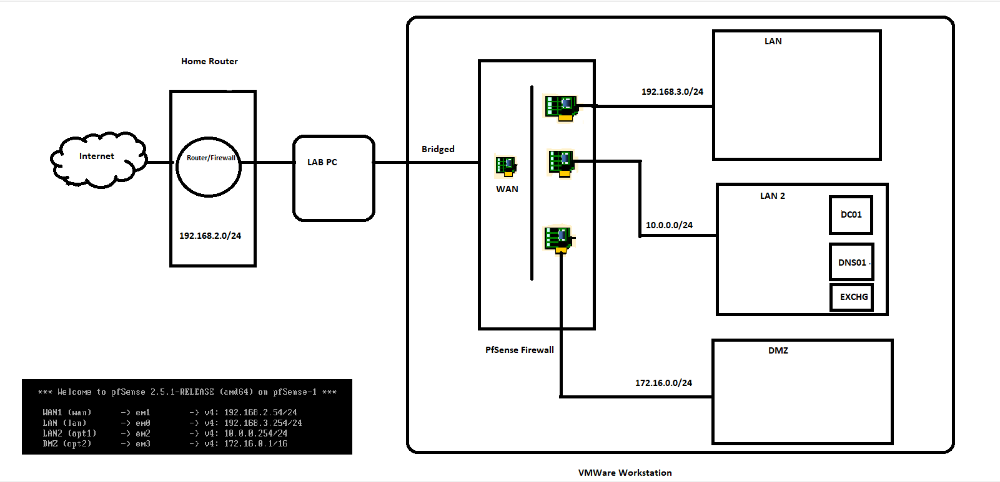
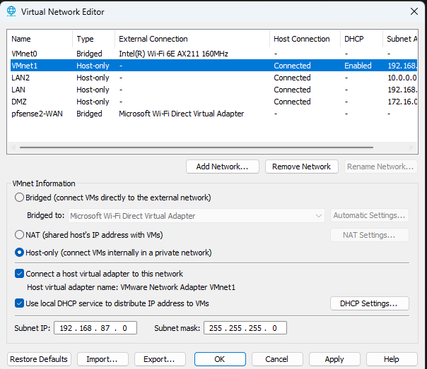

Home Lab PFsense Diagram

I had a desire to establish a virtual lab environment in my home that would replicate the setting of an coporate enviornment / office setup for my system administration labs , testing and everyday learner. My objective was to set up distinct network segments for Clients and Servers, along with a DMZ networks. Additionally, I aimed to simulate the Internet on my home network, even though it technically isn't connected to the virtual lab environment.

To achieve this, I utilized a feature called LAN Segments in VMware Workstation. LAN Segments proved to be an excellent tool for creating private virtual networks for various purposes. However, it's important to note that Workstation's DHCP features cannot be used with LAN Segments.

Consequently, I took on the responsibility of assigning IP addresses to the VMs connected to each LAN segment by configuring static IPs. If I wished to connect multiple LAN segments together, I needed a virtual machine capable of routing traffic between the LAN segments.

Here's a breakdown of how I successfully established multiple "named" LAN segments within VMware Workstation and enabled routing between them using a VM running pfSense, an open-source firewall.

