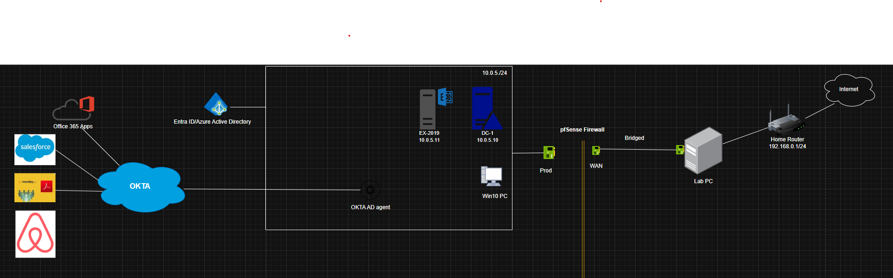

# Homelab IT Infrastructure with VMware, pfSense, Windows Server, and Microsoft Services

## Overview

This project outlines the creation of a homelab environment to simulate a real-world IT infrastructure for learning, testing, and experimentation. The setup includes network management, Windows Server deployment, email configuration with Exchange Server, custom domain integration with Office 365, and plans for Active Directory synchronization with Microsoft Entra ID (formerly Azure AD).

This project is designed for IT professionals and enthusiasts seeking hands-on experience in managing enterprise-grade systems.



---

## Objectives

- Design and implement a virtualized environment to test and explore IT infrastructure concepts.
- Learn to configure and manage networking, domain services, and email systems.
- Integrate on-premises infrastructure with cloud services for hybrid identity management.
- Practice skills in system administration, networking, and cloud integration.

---

## Features and Completed Tasks

### 1. **Network Infrastructure**
- Installed **pfSense** on VMware Workstation to manage network traffic and routing.
- Configured:
  - **WAN Network**: Acts as the external-facing connection.
  - **LAN (prod) Network**: Internal network for hosting all Windows virtual machines.
- Ensured secure communication between the virtual machines and external services.

### 2. **Windows Server 2019 Deployment**
- Installed **Windows Server 2019** as the primary server.
- Promoted the server to a **Domain Controller** for the domain `vegas-IT.local`.
- Configured Active Directory (AD) services to manage domain users, computers, and policies.

### 3. **Exchange Server 2019 Setup**
- Deployed **Exchange Server 2019** on a separate Windows Server 2019 VM.
- Configured the email system for internal and external communication.
- Ensured integration with the domain for seamless user management.

### 4. **Office 365 and Custom Domain Integration**
- Set up an **Office 365 E3 subscription** and added the custom domain `vegas-it.com`, hosted on **AWS Route 53**.
- Updated DNS records in Route 53 to:
  - Verify domain ownership.
  - Enable mail flow and other Office 365 services.
- Created multiple user accounts with the custom domain for testing email and collaboration tools.

### 5. **Integration with Microsoft Entra ID (Planned)**

- Plan to integrate the on-premises Active Directory with **Microsoft Entra ID** using **Azure Entra Connect**.
- The integration will enable:
  - **Hybrid Identity Management**: Synchronizing users and groups between on-premises AD and Entra ID.
  - **Seamless Single Sign-On (SSO)**: Providing users with streamlined access to both on-premises and cloud resources.
  - **Password Hash Synchronization**: Ensuring users can log in with the same credentials across environments.
  - **Federation with Office 365**: Facilitating secure and seamless user access to Microsoft 365 applications.
  - **Multi-Factor Authentication (MFA)**: Enhancing security by enforcing MFA policies for cloud applications.

#### Steps for Integration:
1. **Prepare the Environment**:
   - Verify the on-premises Active Directory (vegas-it.local) is healthy and free of replication errors.
   - Ensure the domain **vegas-it.com** is verified in Microsoft Entra ID.
   - Create and configure a dedicated service account in the local AD for Azure Entra Connect.
   - Open necessary firewall ports for Azure Entra Connect to communicate with Microsoft Entra ID.

2. **Install Azure Entra Connect**:
   - Download the latest version of Azure Entra Connect from Microsoft’s official site.
   - Install it on a server that is joined to the vegas-it.local domain and meets the prerequisites.

3. **Configure Azure Entra Connect**:
   - Select the **Custom Installation** option for advanced configuration.
   - Choose the **Password Hash Synchronization** or **Pass-Through Authentication** method.
   - Specify the service account created earlier for synchronization.
   - Define the Organizational Units (OUs) to sync, including users and groups.

4. **Verify Synchronization**:
   - Check the initial synchronization logs to ensure all objects (users, groups) are synced successfully to the azure domain (vegas-it.com).
   - Use the Microsoft Entra admin center to confirm that the synced accounts are appearing correctly.

     

# Error: Cannot Proceed Because the Sync Service Isn't Running

This document addresses the error encountered when the synchronization process between on-premises Active Directory and Microsoft Entra ID (Azure AD) fails due to the **ADSync service** not running. Follow these steps to resolve the issue.

## **Error Message**
```
Cannot proceed because the sync service isn't running. Start the ADSync service and restart Azure AD Connect.
```

---

## **Steps to Resolve**

### **1. Verify the ADSync Service Status**
1. Open the **Services** console:
   - Press `Win + R`, type `services.msc`, and press Enter.
2. Locate the service named **Microsoft Azure AD Sync**.
3. Check the status:
   - If the service is **stopped**, right-click it and select **Start**.
   - If the service fails to start, proceed to Step 5 to troubleshoot further.

---

### **2. Restart the Azure AD Connect Tool**
1. Open **Azure AD Connect** from the Start menu.
2. Choose the **Synchronize Now** option to trigger a manual synchronization once the service is running.


---
### **3. Check Event Viewer Logs**
1. Open **Event Viewer**:
   - Press `Win + R`, type `eventvwr`, and press Enter.
2. Navigate to the following sections:
   - **Windows Logs > Application**
   - **Windows Logs > System**
3. Look for errors related to **ADSync** or **Azure AD Connect** to identify the root cause of the issue.

---

### **4. Verify Database Connectivity**
The ADSync service uses a local SQL database to function.
1. Ensure the SQL Server (LocalDB) instance used by ADSync is running:
   - Look for services like `MSSQL$MICROSOFT##SSEE` or similar in the **Services** console.
2. If this SQL service is stopped, start it and retry starting the ADSync service.

---

### **5. Reconfigure Azure AD Connect**
If the issue persists:
1. Open **Azure AD Connect**.
2. Rerun the configuration wizard.
3. Validate the credentials for the service account used by Azure AD Connect.

---

### **6. Restart the Server**
As a last resort:
1. Restart the server hosting Azure AD Connect.
2. After rebooting, check the status of the ADSync service and retry the synchronization.

---

## **Common Causes**
- **Service Account Issues**: The account used by Azure AD Connect might have invalid credentials.
- **Database Corruption**: The SQL database used by ADSync may be corrupt or inaccessible.
- **Software Updates**: Recent updates may have disrupted the service.
- **Insufficient Resources**: The server might lack the necessary resources to run the service.

---

## **Event Viewer Log Example**
```
Event ID: 528
Source: ADSync
Description: The Microsoft Azure AD Sync service could not start due to insufficient permissions.
```

---

## **References**
- [Microsoft Documentation: Troubleshooting Azure AD Connect](https://learn.microsoft.com/en-us/azure/active-directory/hybrid/tshoot-connect-sync-errors)
- [SQL LocalDB Troubleshooting Guide](https://learn.microsoft.com/en-us/sql/database-engine/configure-windows/sql-server-express-localdb?view=sql-server-ver15)

### Microsoft Entra Connect: ADSyncTools PowerShell Reference


# Preparing a Non-Routable Domain for Directory Synchronization

When synchronizing your on-premises directory with Microsoft 365, you must have a verified domain in Microsoft Entra ID. Only User Principal Names (UPNs) associated with the on-premises Active Directory Domain Services (AD DS) domain are synchronized. However, UPNs with a non-routable domain, such as `.local` (e.g., `user@vegas-it.local`), are synchronized to an `.onmicrosoft.com` domain (e.g., `user@vegas-it.onmicrosoft.com`).

If your environment uses a `.local` domain for user accounts in AD DS, it is recommended to change them to use a verified domain, such as `vegas-it.com`, to ensure proper synchronization with Microsoft 365.

## What if I only have a `.local` on-premises domain?

You can use Microsoft Entra Connect to synchronize your AD DS to the Microsoft Entra tenant of your Microsoft 365 tenant. However, Microsoft Entra Connect synchronizes only to verified domains. Microsoft Entra ID, which manages Microsoft 365 identities, requires the domain to be a valid Internet domain (e.g., `.com`, `.org`, `.net`).

If your internal AD DS uses only a non-routable domain, such as `.local`, you can resolve this issue by:

1. Changing your primary domain in on-premises AD DS.
2. Adding one or more UPN suffixes.

### Option 1: Change Your Primary Domain
Change your primary domain to a domain you've verified in Microsoft 365, such as `vegas-it.com`. For example, users with the domain `vegas-it.local` would be updated to `vegas-it.com`. While effective, this process can be complex.

### Option 2: Add UPN Suffixes and Update Users
Register new UPN suffixes in AD DS to match the domain(s) verified in Microsoft 365. After registering the new suffix, update user UPNs to replace `.local` with the new domain (e.g., `user@vegas-it.local` becomes `user@vegas-it.com`).

Once UPNs are updated, you can synchronize your on-premises AD DS with Microsoft 365.

## Step-by-Step Guide

### Step 1: Add the New UPN Suffix
1. On the AD DS domain controller, open **Active Directory Domains and Trusts**:
   - From Server Manager, select **Tools > Active Directory Domains and Trusts**.
   - Alternatively, press `Win + R`, type `Domain.msc`, and press **Enter**.

2. In the **Active Directory Domains and Trusts** window, right-click the root node and select **Properties**.

3. On the **UPN Suffixes** tab:
   - In the **Alternative UPN Suffixes** box, type the new UPN suffix, e.g., `vegas-it.com`.
   - Click **Add** and then **Apply**.

4. Click **OK** when done.

### Step 2: Update UPN Suffix for Existing Users
1. On the AD DS domain controller, open **Active Directory Users and Computers**:
   - From Server Manager, select **Tools > Active Directory Users and Computers**.
   - Alternatively, press `Win + R`, type `Dsa.msc`, and press **Enter**.

2. Select a user account, right-click it, and choose **Properties**.

3. On the **Account** tab:
   - In the **User logon name** field, select the new UPN suffix from the dropdown (e.g., `@vegas-it.com`).
   - Click **OK**.

4. Repeat for all user accounts.

### Step 3: Use PowerShell to Update Multiple Users
For large environments, use PowerShell to update UPN suffixes in bulk:

```powershell
# Import Active Directory module
Import-Module ActiveDirectory

# Find all users with the .local suffix and update to .com
Get-ADUser -Filter "UserPrincipalName -like '*@vegas-it.local'" -Properties UserPrincipalName | ForEach-Object {
    $newUPN = $_.UserPrincipalName.Replace("@vegas-it.local", "@vegas-it.com")
    Set-ADUser $_ -UserPrincipalName $newUPN
}
```

This script finds all users with the `@vegas-it.local` suffix and updates their UPN to `@vegas-it.com`.

### Step 4: Sync Changes to Microsoft Entra ID
1. Open the **Azure AD Connect Synchronization Service**.
2. Perform a manual sync:
   ```powershell
   # Import Azure AD Sync module
   Import-Module ADSync

   # Run a delta sync
   Start-ADSyncSyncCycle -PolicyType Delta
   ```

3. Verify synchronization in the Microsoft Entra admin center.

---

By following these steps, you can successfully transition from a non-routable `.local` domain to a verified domain and ensure seamless directory synchronization with Microsoft 365.


5. **Enable Hybrid Features**:
   - Set up Seamless Single Sign-On by enabling the feature in Azure Entra Connect and configuring it in the local AD.
   - Test SSO by logging in with a synchronized user account.

6. **Enhance Security**:
   - Configure **Conditional Access Policies** to require MFA for specific applications or users.
   - Enable **Self-Service Password Reset (SSPR)** for synced users.

7. **Test and Monitor**:
   - Test authentication for both cloud and on-premises applications.
   - Use Azure Entra Connect Health for monitoring synchronization status and addressing potential issues.

8. **Documentation and Maintenance**:
   - Document the setup process and configurations for future reference.
   - Schedule periodic reviews to ensure synchronization remains functional and up to date.

#### Future Goals:
- Explore **Self-Service Password Reset (SSPR)** for users.
- Integrate other SaaS applications with Microsoft Entra ID for centralized identity management.
- Automate provisioning and deprovisioning workflows using Entra ID features.


## Future Enhancements

1. **Hybrid Identity Setup**
   - Configure and test synchronization between on-premises AD and Entra ID.
   - Set up password writeback and self-service password reset.

2. **Advanced Email Features**
   - Configure hybrid mail flow between Exchange Server and Office 365.
   - Test and validate email archiving and retention policies.

3. **Automation**
   - Use PowerShell scripts to automate tasks such as user provisioning, group creation, and domain management.
   - Explore tools like **Ansible** for infrastructure automation.

4. **Device Management**
   - Integrate **Microsoft Intune** for device management and compliance policies.

5. **Monitoring and Security**
   - Set up monitoring tools for system performance and network traffic.
   - Implement security best practices such as firewalls, intrusion detection, and regular patch management.

6. **Documentation**
   - Include step-by-step guides for each configuration.
   - Add diagrams illustrating network and system architecture.

---

## How to Use

Detailed instructions, configurations, and scripts will be provided in this repository. The goal is to enable others to replicate the setup in their own environments for hands-on learning.
